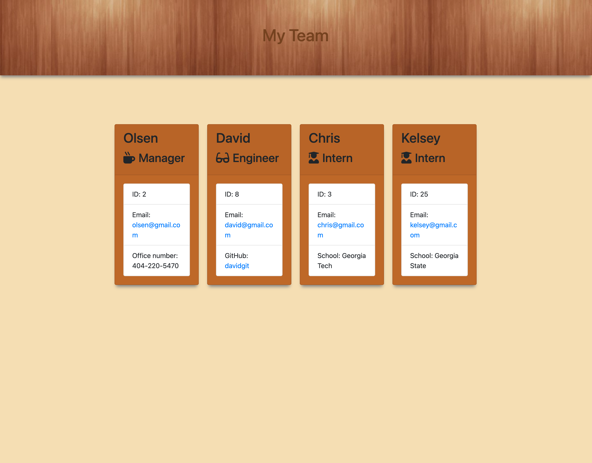

# Team-Profile-Generator

## Description
Team-Profile-Generator is an application that generate a team profile based on the user input using the Inquirer module from Node.js and displaying the information on a newly created html page.

## Core Skills

* Class in Object Oriented Programming in Javascript
* Test Driven Development using Jest in Javascript
* Spread Operator
* HTML
* Bootstrap
* CSS

## Mock-Up

## Review

* Video demo that showcase the utilization of the app
  * [demo](https://watch.screencastify.com/v/fMielrRVx4pShcI7LTGr)

* The URL of the GitHub repository 
* [Repository](https://github.com/Chrisolsen1993/Team-Profile-Generator)

## Collaboration
# David Dyer
# Matthew Flanagan